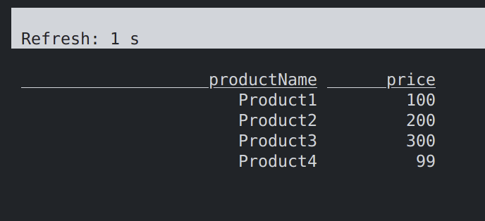

# Using Apache Flink to read data from WarpStream

The following assumes you have a WarpStream account.

You'll need an API Key and a Virtual Cluster. You'll also need to download and run the [WarpStream agent](https://docs.warpstream.com/warpstream/install-the-warpstream-agent)


### Start the WarpStream agent (using local file storage)

```
warpstream agent -agentPoolName apn_default -bucketURL file:///tmp/ -apiKey aks_0000000000 -defaultVirtualClusterID vci_0000000000 -httpPort 8090
```

### Start the WarpStream agent (using s3 storage)

```
warpstream agent -agentPoolName apn_default -bucketURL s3://my-test-bucket/warpstream -apiKey aks_0000000000 -defaultVirtualClusterID vci_0000000000 -httpPort 8090
```

### Create a Topic in WarpStream using the Kafka CLI

You can also create topics in the WarpStream UI

```
/kafka/bin/kafka-topics.sh --create --topic products --bootstrap-server localhost:9092 --partitions 1 --replication-factor 1
```

### Add some sample records to the topic

```
echo '{"productName": "Product1", "price": 100}' | /kafka/bin/kafka-console-producer.sh --topic products --bootstrap-server localhost:9092

echo '{"productName": "Product2", "price": 200}' | /kafka/bin/kafka-console-producer.sh --topic products --bootstrap-server localhost:9092

echo '{"productName": "Product3", "price": 300}' | /kafka/bin/kafka-console-producer.sh --topic products --bootstrap-server localhost:9092
```


You can use the docker-compose.yml file in this repo to create a small Flink cluster and access the Flink client using:

```
docker exec -it jobmanager /opt/flink/bin/sql-client.sh
```

### In Flink, create the following Products table:


```
CREATE TABLE products (
    productName STRING,
    price INT
) WITH (
    'connector' = 'kafka',
    'topic' = 'products',
    'properties.bootstrap.servers' = 'api-000000000000000.warpstream.com:9092',
    'properties.group.id' = 'warpstream',
    'scan.startup.mode' = 'earliest-offset',
    'format' = 'json',
    'json.fail-on-missing-field' = 'false',
    'json.ignore-parse-errors' = 'true'
);
```

And then you can query the data using:

```
select * from products;
```

You'll see the records populate in the Flink console:




### Data storage

The files created by WarpStream on your local file system or s3 look like below, with a folder per topic message

```
/tmp/warpstream/warpstream/vci_0000000000/
├── 00001
│   ├── 0000000000000001
│   └── 0000000000000001.attrs
├── 00002
│   ├── 0000000000000002
│   └── 0000000000000002.attrs
├── 00003
│   ├── 0000000000000003
│   └── 0000000000000003.attrs
└── 00004
    ├── 0000000000000004
    └── 0000000000000004.attrs
```